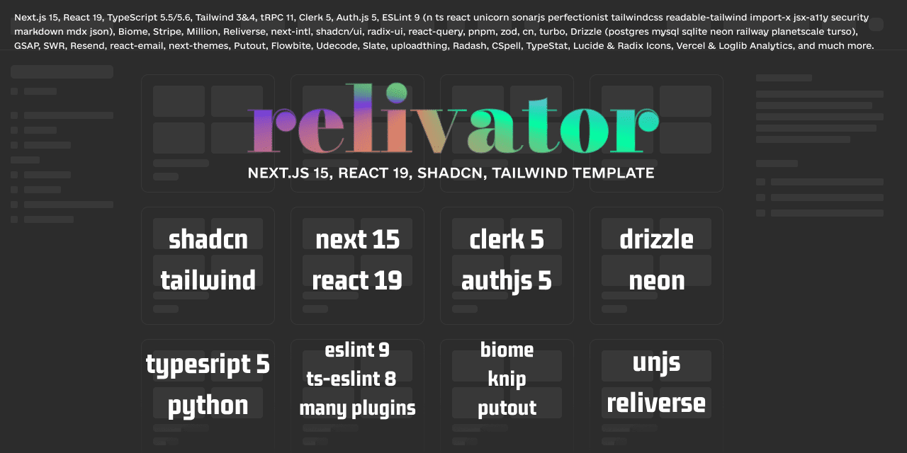

*Post update date: August 20, 2024.*

> We are currently in the process of migrating the documentation from Relivator's README.md to this site (Relivator & Reliverse Docs). We plan to divide everything into appropriate sections. During the migration, some things might not work properly. Please let us know if you encounter any issues.

## Relivator 1.2.6 (August 4, 2024): The Resurrection Update

**Relivator is Back With Version 1.2.6 🥳!**

We are thrilled to announce the release of Relivator 1.2.6! This update marks a significant shift away from the "all-in-one" approach, paving the way for a modular future starting with Reliverse CLI in version 1.3.0. This release includes major updates, particularly enhancing the developer experience (DX). The README.md has been thoroughly revamped. Moving forward, we will introduce new version management branches: Dev (early-access for sponsors), Canary, Release Candidate (RC), and General Availability (GA). Version 1.2.6 serves as a solid foundation, enabling a smoother transition to the 1.3.0 branches.

### Major Changes and Improvements

- **Updated Dependencies:** We've upgraded to next-auth v5, clerk v5, with optional support for tailwindcss v4. Work on migrating from React 18 to React 19 has also begun.
- **Final Dual-Integration Release:** This is the last version supporting both PostgreSQL/MySQL and NextAuth.js/Clerk database integrations. Check out the updated Installation section in the README.md for more details.

### Migration Guidance

Starting with version 1.3.1, we will offer comprehensive migration guides. The usual process involves reviewing commit changes and integrating updates into your custom code. However, due to the extensive modifications in versions 1.2.6 and 1.3.0, this method is impractical. We recommend reinstalling the project and migrating your custom features from the previous version to the new starter version. We appreciate your understanding!

For a smoother migration, use an "`addons/cluster`" folder and move all your custom code there. If necessary, use the [Find and Replace](https://code.visualstudio.com/docs/editor/codebasics#_search-and-replace) feature in VSCode to adjust paths. This will simplify the process of transferring your custom code to Relivator 1.2.6.

Please note that the relative paths to the `src` folder use `~`, while paths to `addons` use `@`.

### Default Database Change

Neon PostgreSQL is now the default database, replacing PlanetScale MySQL, which no longer offers a free tier. If you still need MySQL, [Railway](https://railway.app?referralCode=sATgpf) provides an affordable alternative with a $5 credit without requiring a credit card. Please note that this version has been primarily tested with Neon PostgreSQL.

### Security and Code Improvements

- **Enhanced Type Safety and Editor Autocomplete:** We've improved type safety and editor autocomplete for Drizzle ORM libraries.
- **Biome Replaces Prettier:** Prettier has been removed in favor of Biome. The Prettier config will be removed from the `src/temp` folder in the next version. You can re-add it by running the `reliverse` command starting with Relivator 1.3.0.

### Reliverse Scripts Transition

Reliverse scripts have advanced from the "unknown viability" stage to the "unstable" stage. As always, use them at your own risk and make backups. These scripts are now located in the `src/tools/unstable` folder and require Python to run.

For more details, check out my posts in the Relivator thread on Discord, starting with [this message](https://discord.com/channels/1075533942096150598/1155482425862922370/1241995095125786624).

### Thank You for Your Support

If you have any questions or issues, feel free to contact me, @blefnk, on Discord or GitHub. For more information about versions 1.2.6 and 1.3.0, visit the `#⭐-relivator` chat on our Discord server or check out the [GitHub Issues](https://github.com/blefnk/relivator-nextjs-template/issues) page.

Thank you for your continued support, and happy coding with the [Reliverse Website Builder v0.4.0](https://github.com/blefnk/reliverse-website-builder) and [Relivator Next.js Template v1.2.6](https://github.com/blefnk/relivator-nextjs-template)!

## Stay Tuned for More Updates

**This changelog is still being updated. While you're welcome to read it now, check back later for more information. The newly revised [README.md](https://github.com/blefnk/relivator-nextjs-template#readme) also contains valuable insights into this update.**

## Git Release Notes

**Full Commit Changelog:** <https://github.com/blefnk/relivator-nextjs-template/compare/1.2.5...1.2.6>
